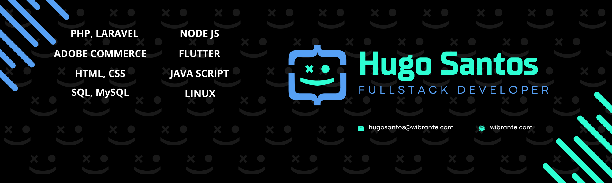

#  Hola, mi nombre es Hugo Santos 👋
### Fullstack Developer

Soy **desarrollador backend especializado en ecommerce** con más de **12 años de experiencia** creando soluciones tecnológicas para empresas de distintos tamaños, tanto nacionales como internacionales.  

💻 En los últimos años me he enfocado en el desarrollo y mantenimiento de **tiendas en línea**, trabajando con **Magento y Adobe Commerce**, donde además cuento con certificación oficial de Adobe.  

📊 También he participado en el desarrollo de diversos **sistemas empresariales y administrativos**, diseñados para optimizar procesos internos, mejorar la eficiencia operativa y brindar a las empresas un mayor control sobre sus recursos y operaciones. 

📱 He participado en proyectos de **aplicaciones móviles** y disfruto diseñar arquitecturas escalables, planificar estrategias de desarrollo y llevar proyectos desde la idea hasta su implementación completa.  

⚡ Me apasiona **resolver problemas complejos**, optimizar procesos y crear soluciones que realmente aporten valor a los negocios.  

---

## 🚀 Tecnologías y herramientas principales
- **Lenguajes:** PHP, C#, JavaScript, Dart, SQL  
- **Frameworks y plataformas:** Node.js, ASP.NET, Magento 2 / Adobe Commerce, Laravel, Flutter
- **Bases de datos:** MySQL, MariaDB, SQL Server, MongoDB
- **Otros:** Linux, Servidores, VPS, AWS

---

## 🌎 Lo que me motiva
Más allá del código, me motiva la posibilidad de **transformar ideas en productos funcionales** que impacten a las personas y ayuden a las empresas a crecer.  

---

👉 Conecta conmigo
- [Linkedin](https://www.linkedin.com/in/hugovhs/)
- [Sitio personal](https://hugovhs.dev)
- email: hugo_vhs@msn.com
